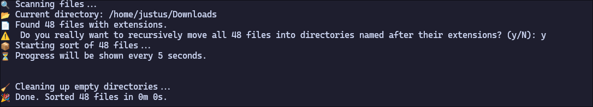

# sort-files-by-extension
This script recursively sorts all files in the directory the file gets executed from by moving them into directory's named after their extension.
## Functionality
The script automatically creates the directories if they do not already exist and removes old (not empty) ones.

> [!CAUTION]
> After execution of this script, the complete folder structure is lost, due to this script recursively searching for files, and moving them regardless of subdirectories.

## How to use
1. Install all [Dependencies](#Dependencies)
2. Move the script to the directory which in which the file should get sorted based on extension
3. Execute the script:
    ```shell
    ./sort-files-by-extension.sh
    ```

> [!CAUTION]
> Make sure to run the script in the directory you want to sort, as it will move files from the current directory and all subdirectories.

## Dependencies
- bash
- pwd
- find
- basename
- mkdir
- mv
- date
- echo

---
## Screenshot

