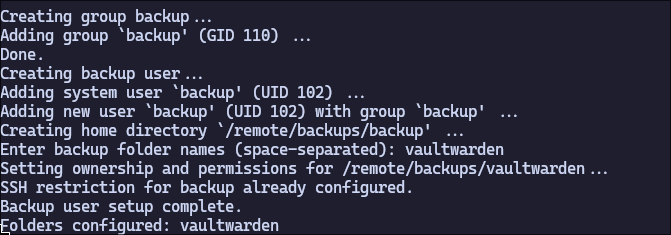

# add-remote-backup-user-and-directory
This script adds a user with werry limited permissions, that can be used by other services to push remote backups to this server.
## Functionality
The script automatically creates the `backup` user, and sets permissions for it.

- The user cannot login interactively via SSH, and anny attempt to get a shell will fail.
- The user can only access `/remote/backups/*` and nothing else.
- The user can only run `SFTP/SCP`

## How to use
1. Install all [Dependencies](#Dependencies)
2. Execute the script:
    ```shell
    add-remote-backup-user-and-directory.sh
    ```
3. Specify the name of the subdirectory (`/remote/backups/NAME`) to create

## Dependencies
- getent
- sudo
- addgroup
- adduser
- usermod
- mkdir
- chown
- chmod
- grep
- tee
- systemctl
- read

---

## Screenshot

