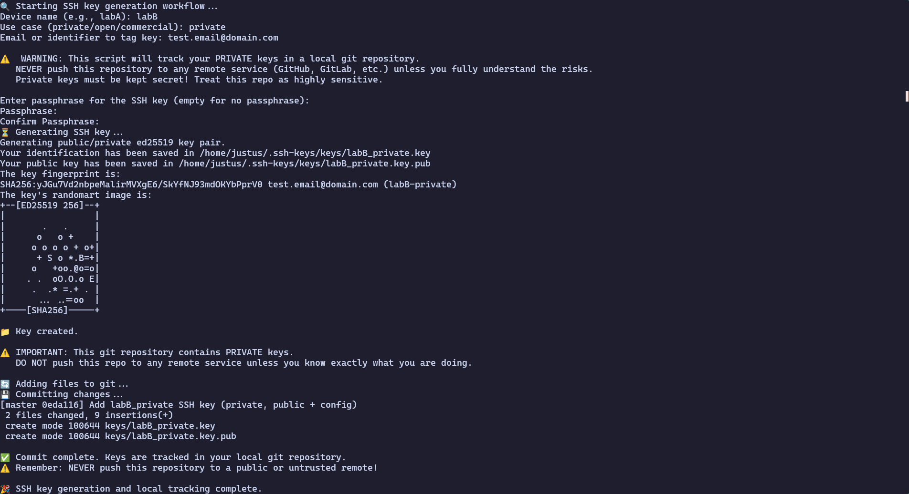

# ssh-keygen-helper
This script Helps with the creation of ed25519 SSH-Keys.

## Functionality

Created keys are saved like this: `~/.ssh-keys/keys/<deviceName>_<usecase>.key(.pub)`.

The script also automatically commits the keys to the local (automatically created) git repo at `~/.ssh-keys`.
> [!CAUTION]
> Private keys are also commited to the repo, it is therefore strongly advised to not push the git repo to a server.

## How to use
1. Install all [Dependencies](#Dependencies)
2. Execute the script:
    ```shell
    ./ssh-keygen-helper.sh
    ```
3. Enter device name
4. Enter use case of ssh-key
5. Enter Email or identifier
6. (optional) Enter passphrase

## Dependencies
- bash
- ssh-keygen
- git

## Screenshot

