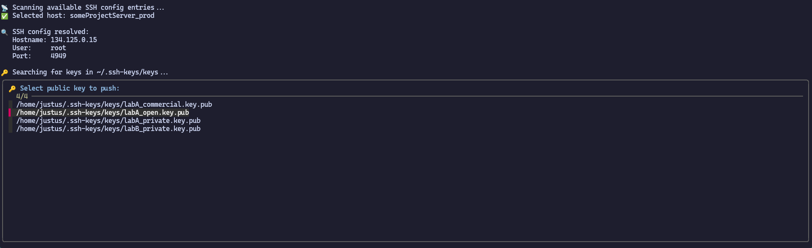

# ssh-key-pusher
This script helps with adding local SSH-keys to the `.ssh/authorized_keys` file of servers.

## Functionality
Servers are detected by searching in the local `.ssh/config` file.
> [!TIP]
> To manage the `.ssh/config`, a tool like [ssh-tui](https://github.com/Flottegurke/ssh-tui) might be useful.

SSH-keys are detected by searching in `~/.ssh-keys/keys/` for `.pub` fies
> [!TIP]
> Keys generated with [ssh-keygen-helper](../ssh-keygen-helper) will be automatically stored there


## How to use
1. Install all [Dependencies](#Dependencies)
2. Execute the script:
    ```shell
    ./ssh-keypush-helper.sh
    ```
3. Select the server to which to add the SSH-key
4. Select which SSH-key to add
5. Enter password of server

## Dependencies
- bash
- awk
- fzf
- ssh
- sshpass
- mkdir
- chmod
- cat
- echo
 
## Screenshot

