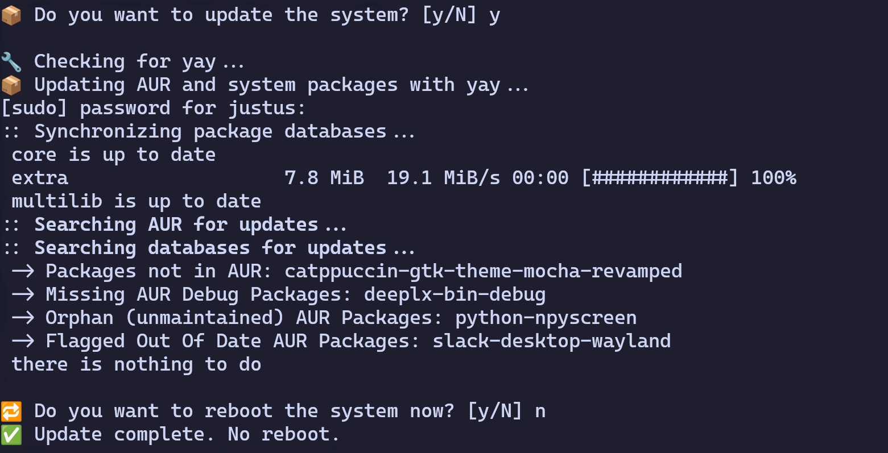

# update-helper
## Functionality
This script helps with updating system packages.

### Screenshot

## How to use
To use the script, just execute it, after installing all necessary dependencies.

## Dependencies
- pacman
- yay (optional)
